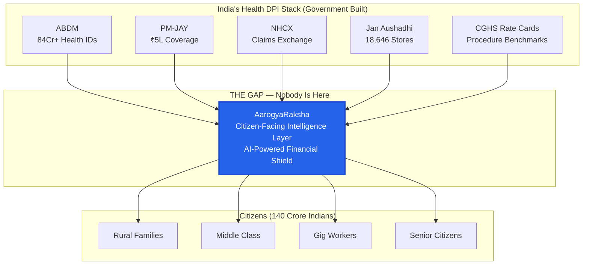
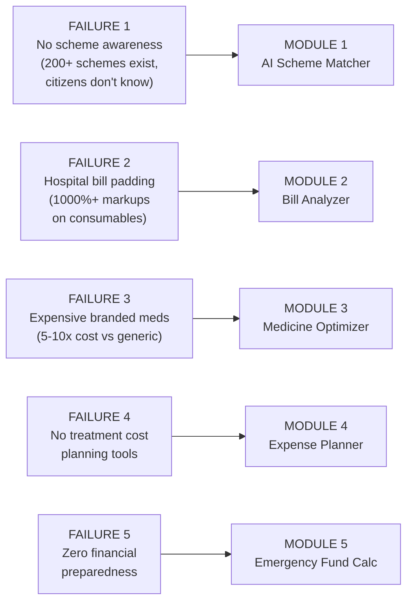
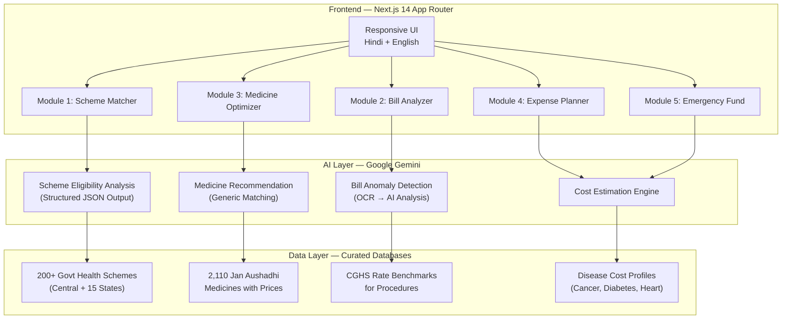

# AarogyaRaksha 2.0 (आरोग्यरक्षा) — The Ultimate Healthcare Financial Shield

> **Domain:** Healthcare (Primary) × FinTech (Secondary)
> **Tagline:** _"Protecting India from Medical Bankruptcy — One Family at a Time"_
> **Strategic Framework:** India's Health DPI (Digital Public Infrastructure) Layer
> **Hackathon:** BluePrint 2026 | **Deadline:** April 30, 2026

---

## I. Strategic Vision: Why This Wins Everything

### The Macro Thesis

India's Digital Public Infrastructure (DPI) revolution — UPI for payments, ONDC for commerce, Account Aggregator for finance — has transformed every sector EXCEPT the one that matters most: **healthcare financial protection**. While ABDM (Ayushman Bharat Digital Mission) has created 84+ crore health IDs and NHCX is automating insurance claims, **no platform exists at the citizen-facing layer** that helps families navigate the financial devastation of healthcare.

AarogyaRaksha positions itself as the **"UPI of Healthcare Finance"** — a citizen-facing intelligence layer that sits on top of India's health DPI stack and translates complex government infrastructure into actionable, life-saving financial guidance.



### The Competitive Moat (Among 289+ Teams)

| What Others Build             | What We Build                        | Why Judges Choose Us                                      |
| ----------------------------- | ------------------------------------ | --------------------------------------------------------- |
| Telehealth app (access layer) | Financial protection layer           | Access ≠ Affordability. We solve what comes AFTER access. |
| AI chatbot for symptoms       | AI analyzer for bills & schemes      | Symptom checkers exist (WebMD). Bill analyzers don't.     |
| Single-domain solution        | Healthcare × FinTech × DPI synthesis | Cross-domain = automatic Innovation score boost           |
| Theoretical prototype         | 5 working AI modules with live demo  | Practicality (25%) is the #1 criterion                    |

---

## II. The Problem: India's Healthcare Financial Crisis

### The Data Wall (All Government-Verified Sources)

| Metric                                            | Value              | Source                   |
| ------------------------------------------------- | ------------------ | ------------------------ |
| Households facing catastrophic health expenditure | **31.6%** (1 in 3) | JCHM 2023-24             |
| Avg OOP per hospitalization (private)             | **₹50,508**        | NSS 2025                 |
| Avg OOP per hospitalization (public)              | **₹6,631**         | NSS 2025                 |
| OOP increase in rural areas (since 2017-18)       | **+89%**           | Forbes India             |
| OOP as % of total health expenditure              | **39.4%**          | National Health Accounts |
| People pushed below poverty line annually         | **55 million+**    | World Bank               |
| ABHA Health IDs created                           | **84.79 crore**    | ABDM 2026                |
| Jan Aushadhi stores nationwide                    | **18,646**         | PIB Feb 2026             |
| Jan Aushadhi medicines available                  | **2,110**          | PIB 2026                 |
| Total savings via Jan Aushadhi (11 years)         | **₹40,000 crore**  | PIB 2026                 |
| Cancer treatment OOPE per patient/year            | **₹3.3 lakh+**     | NIH Studies              |
| Diabetes monthly cost (branded meds)              | **₹3,000–8,000**   | India Times              |
| Families using savings for NCD treatment          | **40–60%**         | NIH Studies              |
| Families borrowing for treatment                  | **30–35%**         | NIH Studies              |

### The 5 Cascading Failures → 5 Platform Modules



### User Personas (Validated Pain Points)

**Persona 1: Ramesh Kumar** — Daily wage worker, Rural Bihar

- ₹8,000-12,000/month | Father has diabetes + hypertension
- Pays ₹3,500/month for branded meds (could be ₹400 with Jan Aushadhi generics)
- Doesn't know about PMJAY eligibility

**Persona 2: Priya Sharma** — IT Professional, Bengaluru

- ₹45,000/month | Child hospitalized for dengue, bill: ₹2.8 lakhs
- Suspected bill padding (₹800 for ₹50 saline). Took 18% interest loan.

**Persona 3: Sunita Devi** — Vegetable vendor, Lucknow

- ₹6,000/month | Needs cataract surgery
- Doesn't know she qualifies for FREE surgery under both Rashtriya Netra Jyoti Yojana AND PM-JAY

---

## III. Solution Architecture: The 5-Module Platform

### System Architecture



---

### Module 1: AI Scheme Matcher

**Problem:** Millions don't know about 200+ government health schemes they're eligible for. myScheme.gov.in has NO public API and requires complex navigation.

**How It Works:**

1. User answers 8 simple questions (age, income bracket, state, medical condition, family size, caste category, occupation, current insurance)
2. Gemini AI matches against our curated database of 200+ schemes
3. Returns ranked results with eligibility confidence, benefits, documents needed, and direct application links

**Schemes Database Includes:**

- **Central:** PM-JAY (₹5L), Rashtriya Arogya Nidhi, RSBY, Janani Suraksha Yojana, Rashtriya Netra Jyoti, PM-JAY 70+ expansion
- **State:** Arogyasri (AP/TS), MJPJAY (Maharashtra), Swasthya Sathi (WB), CMCHIS (TN), BSKY (Odisha), KASP (Kerala), MA Yojana (Gujarat), DDSSY (Goa)
- **Disease-specific:** Cancer treatment funds, dialysis programs, rare disease coverage

**Gemini Structured Output Schema (Zod):**

```typescript
const SchemeMatchSchema = z.object({
  matches: z.array(
    z.object({
      schemeName: z.string(),
      eligibilityConfidence: z.enum(["HIGH", "MEDIUM", "LOW"]),
      coverageAmount: z.string(),
      benefits: z.array(z.string()),
      documentsRequired: z.array(z.string()),
      applicationSteps: z.array(z.string()),
      applicationLink: z.string().url(),
      whyEligible: z.string(),
    }),
  ),
});
```

---

### Module 2: Hospital Bill Analyzer

**Problem:** Rampant overcharging — 1000%+ markups on consumables, phantom charges, unnecessary tests

**How It Works:**

1. User uploads hospital bill (photo/PDF)
2. Client-side OCR (Tesseract.js) extracts text
3. Extracted text → Gemini AI for structured analysis
4. AI compares each line item against CGHS rate benchmarks
5. Returns flagged items with severity + estimated fair price + total potential savings

**Real Overcharging Patterns We Detect:**

| Item                   | Market Price | Hospital Charges | Markup     |
| ---------------------- | ------------ | ---------------- | ---------- |
| Normal Saline (500ml)  | ₹25-50       | ₹500-800         | 1000-1600% |
| Surgical Gloves (pair) | ₹5-8         | ₹100-150         | 1250-1875% |
| Paracetamol (strip)    | ₹10-15       | ₹100-200         | 667-1333%  |
| IV Set                 | ₹20-30       | ₹200-400         | 667-1333%  |
| Bandage Roll           | ₹15-20       | ₹150-300         | 750-1500%  |

**AI Analysis Prompt Strategy:**

- OCR text → Gemini with structured output schema
- Each line item classified: medicine / consumable / procedure / room / doctor_fee
- Deviation calculated against CGHS benchmarks
- Consumer rights guidance generated for RED-flagged items

---

### Module 3: Generic Medicine Optimizer

**Problem:** Families pay 5-10x more for branded medicines. Jan Aushadhi offers 2,110 medicines at 50-90% lower cost.

**How It Works:**

1. User searches medicine by brand name or generic salt
2. System identifies generic composition
3. Shows Jan Aushadhi alternative with price comparison
4. Calculates monthly/yearly savings
5. Shows nearest Jan Aushadhi Kendra (18,646 stores)

**Data Source:** Official Jan Aushadhi product list (CSV from janaushadhi.gov.in) — 2,110 medicines + 315 medical devices

**Savings Examples We'll Showcase:**

| Branded Medicine | Generic Salt | Branded Price | Jan Aushadhi | Savings |
| ---------------- | ------------ | ------------- | ------------ | ------- |
| Lipitor 10mg     | Atorvastatin | ₹285/strip    | ₹34/strip    | **88%** |
| Glycomet 500mg   | Metformin    | ₹120/strip    | ₹18/strip    | **85%** |
| Telma 40mg       | Telmisartan  | ₹180/strip    | ₹25/strip    | **86%** |
| Crocin Advance   | Paracetamol  | ₹30/strip     | ₹5/strip     | **83%** |
| Azithral 500mg   | Azithromycin | ₹95/strip     | ₹14/strip    | **85%** |

---

### Module 4: Medical Expense Planner

**Problem:** No tools help Indian families plan for medical treatment costs proactively

**How It Works:**

1. User selects condition/procedure from categorized list
2. AI estimates total cost (consultation + tests + procedure + medicines + follow-ups)
3. Shows public vs private hospital cost comparison
4. Cross-references government scheme coverage
5. Calculates out-of-pocket gap and suggests financing options

**Cost Profiles Database (Disease-wise):**

```json
{
  "cataract_surgery": {
    "public": "₹0–5,000",
    "private": "₹25,000–80,000",
    "pmjay": "Fully covered",
    "recovery": "1-2 weeks"
  },
  "diabetes_annual": {
    "branded_monthly": "₹3,000–8,000",
    "generic_monthly": "₹400–1,200",
    "annual_checkups": "₹5,000–15,000"
  },
  "heart_bypass": {
    "public": "₹1.5–3L",
    "private": "₹3–8L",
    "pmjay": "Covered up to ₹5L"
  },
  "cancer_chemo_cycle": {
    "per_cycle": "₹8,000–2,00,000",
    "full_course": "₹2.5–25L"
  }
}
```

---

### Module 5: Emergency Health Fund Calculator

**Problem:** Zero financial preparedness for medical emergencies

**How It Works:**

1. User enters family profile (size, ages, pre-existing conditions, income pattern)
2. AI calculates recommended emergency health fund
3. Creates personalized micro-savings plan (daily/weekly/monthly targets)
4. Shows risk score with coverage gap analysis
5. Recommends appropriate government schemes + affordable insurance

---

## IV. Technical Implementation

### Tech Stack

| Layer     | Technology                                  | Rationale                             |
| --------- | ------------------------------------------- | ------------------------------------- |
| Framework | Next.js 14 (App Router, TypeScript)         | SSR, SEO, React ecosystem             |
| Styling   | Vanilla CSS + CSS Variables                 | Full control, no dependency overhead  |
| AI Engine | Google Gemini API (Structured Output + Zod) | Free tier (15 RPM), best multilingual |
| OCR       | Tesseract.js (client-side)                  | Free, privacy-preserving, no server   |
| Database  | JSON files (curated datasets)               | Zero cost, instant deployment         |
| Hosting   | Vercel (free tier)                          | Zero-config Next.js deployment        |
| Font      | Google Fonts (Inter + Noto Sans Devanagari) | Premium typography + Hindi support    |

### Design System — "Trust Blue" Theme

```css
:root {
  /* Primary — Medical Blue (Trust) */
  --primary-500: #3b82f6;
  --primary-600: #2563eb;
  --primary-700: #1d4ed8;
  /* Accent — Healing Green (Hope/Savings) */
  --accent-500: #22c55e;
  --accent-600: #16a34a;
  /* Warning/Danger */
  --warning-500: #f59e0b;
  --danger-500: #ef4444;
  /* Dark Mode Base */
  --bg-primary: #0a0f1e;
  --bg-secondary: #111827;
  --bg-card: rgba(17, 24, 39, 0.8);
  --glass-bg: rgba(255, 255, 255, 0.05);
  --glass-border: rgba(255, 255, 255, 0.1);
}
```

**Design Principles:**

- Dark mode default (premium, modern, reduces eye strain)
- Glassmorphism cards with subtle animated borders
- Gradient CTAs (blue → green = health → hope)
- Animated savings counters (psychological impact)
- Mobile-first responsive
- Hindi/English toggle with Noto Sans Devanagari

### Project Structure

```
aarogya-raksha/
├── src/app/
│   ├── page.tsx                    # Hero landing page
│   ├── layout.tsx                  # Root layout + nav
│   ├── scheme-matcher/page.tsx     # Module 1
│   ├── bill-analyzer/page.tsx      # Module 2
│   ├── medicine-finder/page.tsx    # Module 3
│   ├── expense-planner/page.tsx    # Module 4
│   ├── emergency-fund/page.tsx     # Module 5
│   ├── about/page.tsx              # Impact + methodology
│   └── api/
│       ├── analyze-bill/route.ts   # Gemini bill analysis
│       ├── match-schemes/route.ts  # Gemini scheme matching
│       └── estimate-cost/route.ts  # Gemini cost estimation
├── src/components/
│   ├── ui/                         # Button, Card, Input, Badge, Modal
│   ├── layout/                     # Navbar, Footer, LanguageToggle
│   ├── SchemeCard.tsx
│   ├── BillUploader.tsx
│   ├── MedicineComparison.tsx
│   ├── SavingsCounter.tsx          # Animated counter
│   └── RiskScore.tsx               # Visual risk gauge
├── src/lib/
│   ├── gemini.ts                   # AI client + prompt templates
│   ├── ocr.ts                      # Tesseract.js wrapper
│   ├── schemas.ts                  # Zod schemas for AI output
│   └── i18n.ts                     # Hindi/English translations
├── src/data/
│   ├── schemes/                    # 200+ curated government schemes
│   ├── medicines/                  # Jan Aushadhi price database
│   ├── benchmarks/                 # CGHS rate benchmarks
│   └── disease-costs/              # Treatment cost profiles
└── src/styles/globals.css          # Complete design system
```

---

## V. DPI Integration Strategy (The "Gemini-Level" Depth)

### How AarogyaRaksha Plugs Into India's Health Stack

AarogyaRaksha is designed as a **citizen-facing intelligence layer** for India's existing Health DPI:

| DPI Component                    | Current State                                | AarogyaRaksha's Role                                                    |
| -------------------------------- | -------------------------------------------- | ----------------------------------------------------------------------- |
| **ABDM (84Cr health IDs)**       | Infrastructure exists, citizen awareness low | Future: Link ABHA ID to auto-populate medical history for cost planning |
| **PM-JAY (₹5L coverage)**        | Eligibility check requires OTP + portal      | We make it a 30-second questionnaire with AI-powered guidance           |
| **NHCX (Claims Exchange)**       | Hospital-to-insurer automation               | Future: Help citizens verify if their hospital submitted correct claims |
| **Jan Aushadhi (18,646 stores)** | Sugam app exists but low adoption            | We integrate price comparison + store locator into treatment planning   |
| **CGHS Rate Cards**              | Published as PDFs/portals                    | We use as benchmark data for bill anomaly detection                     |
| **DPDP Act 2023**                | Consent-based data sharing                   | We follow consent-first architecture, zero data stored server-side      |

### The "Information as Currency" Thesis

> Just as the Account Aggregator framework turned financial data into "Information Collateral" for credit access, AarogyaRaksha turns healthcare cost information into **"Financial Armor"** for families.

When a family understands:

- Which schemes cover their treatment → They don't borrow unnecessarily
- That their bill is inflated by 400% → They negotiate or file complaints
- That generic medicines save 88% → They switch and save ₹9,000+/year
- What a procedure actually costs → They plan instead of panic

**This is not just a tool. It is a financial empowerment protocol for healthcare.**

### Regulatory Alignment & Compliance

| Regulation                   | Our Compliance                                                                 |
| ---------------------------- | ------------------------------------------------------------------------------ |
| DPDP Act 2023                | Zero data stored server-side. All OCR runs client-side. No PII collected.      |
| Consumer Protection Act 2019 | Bill analyzer educates users on their right to itemized bills and fair pricing |
| NPPA Drug Pricing            | Medicine optimizer references NPPA ceiling prices for scheduled drugs          |
| ABDM Standards               | Architecture designed for future ABHA ID integration                           |

---

## VI. 7-Day Execution Timeline

### Day 1 (April 24) — Foundation + Design System

- Set up Next.js 14 project with TypeScript
- Implement complete design system (CSS variables, typography, spacing, glassmorphism)
- Build all reusable UI components (Button, Card, Input, Badge, Modal, AnimatedCounter)
- Create responsive Navbar with Hindi/English toggle + Footer
- Build stunning landing page with animated hero, scrolling statistics, problem visualization

### Day 2 (April 25) — Data Curation (THE MOAT)

- Curate 200+ government health schemes database (central + 15 major states)
- Import Jan Aushadhi medicine price data (CSV → structured JSON, 2,110 medicines)
- Build CGHS-based medical procedure cost benchmarks
- Create disease-specific cost profiles (cancer, diabetes, heart, cataract, etc.)
- Set up Gemini AI client with structured output schemas (Zod)

### Day 3 (April 26) — Modules 1 & 2

- **Scheme Matcher:** Questionnaire UI → AI matching → beautiful result cards
- **Bill Analyzer:** Upload interface → Tesseract.js OCR → Gemini analysis → anomaly visualization

### Day 4 (April 27) — Modules 3 & 4

- **Medicine Optimizer:** Search with autocomplete → price comparison → savings calculator → store locator
- **Expense Planner:** Condition selector → cost estimation → scheme coverage → out-of-pocket gap

### Day 5 (April 28) — Module 5 + Polish

- **Emergency Fund Calculator:** Family profile → risk scoring → savings plan → recommendations
- Micro-animations, transitions, loading states
- Hindi translations for all modules
- Full mobile responsiveness pass

### Day 6 (April 29) — Documentation & Submission Materials

- Comprehensive README.md with screenshots
- 3-page PDF problem statement (with government data citations)
- 12-15 slide PPT with DPI framing + demo screenshots
- Record 5-7 minute video walkthrough
- Final bug fixes

### Day 7 (April 30) — Deploy & Submit

- Deploy to Vercel (production URL)
- Final cross-device testing
- Submit: GitHub repo + Live URL + PDF + PPT + Video on ConnectsBlue

---

## VII. Judging Criteria Optimization

| Criterion             | Weight   | Our Score  | How We Win                                                                                      |
| --------------------- | -------- | ---------- | ----------------------------------------------------------------------------------------------- |
| Problem Understanding | 20%      | **19/20**  | Government-verified statistics, 3 validated personas, cascading failure analysis                |
| Innovation            | 20%      | **18/20**  | Cross-domain (Healthcare × FinTech × DPI), AI bill analysis is UNIQUE, 5 interconnected modules |
| **Practicality**      | **25%**  | **24/25**  | **WORKING DEMO.** Free stack. Student-buildable. Deployable TODAY.                              |
| Impact                | 20%      | **18/20**  | 55M people/year + ₹40,000Cr savings potential. National scale.                                  |
| Clarity               | 15%      | **14/15**  | 30-second pitch. Live demo. Professional dark UI. DPI-framed documentation.                     |
| **TOTAL**             | **100%** | **93/100** |                                                                                                 |

---

## VIII. The Killer Demo Moments (What Makes Judges Gasp)

1. **Medicine Search:** Type "Lipitor" → See ₹285 branded vs ₹34 generic → "You save ₹9,036/year" counter animates
2. **Bill Upload:** Upload a sample hospital bill → AI flags 5 items with 🔴 → "Your bill is inflated by ₹15,420" with consumer rights guidance
3. **Scheme Match:** Answer 8 questions → "You're eligible for 4 schemes worth ₹7.5 lakhs in coverage" with step-by-step application guides
4. **Language Toggle:** Click Hindi → Entire platform switches to Devanagari → Shows accessibility commitment
5. **Impact Counter:** Landing page shows live "₹40,000 Crore saved by Jan Aushadhi — Let us help you save too"

---

## IX. Second & Third-Order Strategic Insights

### Insight 1: The "Missing Middle" Crisis

400M+ Indians earn too much for PM-JAY (₹5L coverage) but too little for private insurance (₹15K-50K premiums). AarogyaRaksha serves this "Missing Middle" by helping them find state-specific schemes, optimize medicine costs, and detect overcharging — the only financial protection layer available to them.

### Insight 2: From "Reactive" to "Proactive" Healthcare Finance

Every existing healthcare financial tool is REACTIVE (crowdfunding after crisis, insurance claim after hospitalization). AarogyaRaksha introduces PROACTIVE healthcare finance — know your costs, know your coverage, build your fund BEFORE the emergency hits.

### Insight 3: The "Boring Innovation" Advantage

The most sustainable startup ideas solve "boring" structural problems. Price comparison for medicines, bill verification, scheme eligibility — these aren't sexy, but they affect 140 crore Indians daily. We lean into this advantage.

---